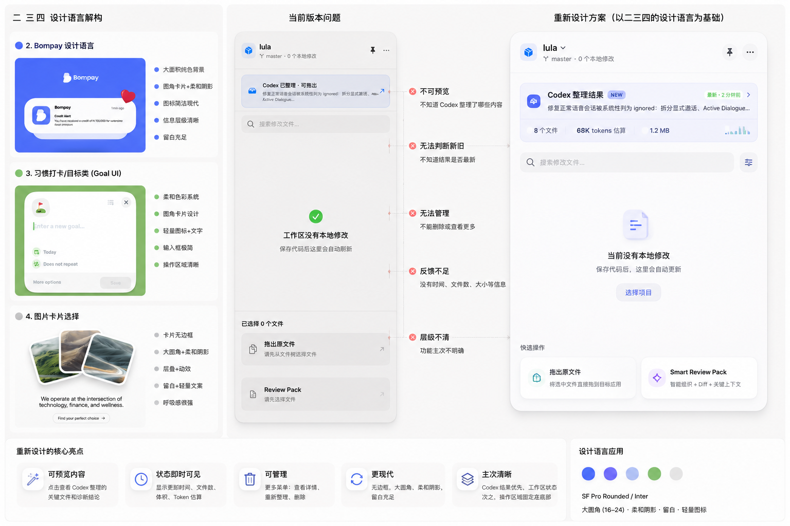

# TermiNap 设计参考

本文归档产品设计过程中的对照稿与视觉参考，供后续界面重构、发布素材制作和设计复盘使用。图片仅代表设计方向，不等同于当前已经实现的产品界面或能力。

## 初始设计对照稿

该对照稿包含三部分：

- 左侧：圆角卡片、柔和阴影、轻量图标与留白等设计语言参考；
- 中间：当前版本在结果预览、新旧状态、管理入口、反馈信息和层级表达上的问题；
- 右侧：以结果卡片、时间和文件统计、明确主操作区及快捷操作为核心的重设计方向。

后续实现不能把图中的示意功能视为既有能力。实际产品范围和发布承诺仍以 [`../MARKETING_PLAN.md`](../MARKETING_PLAN.md) 为准。
