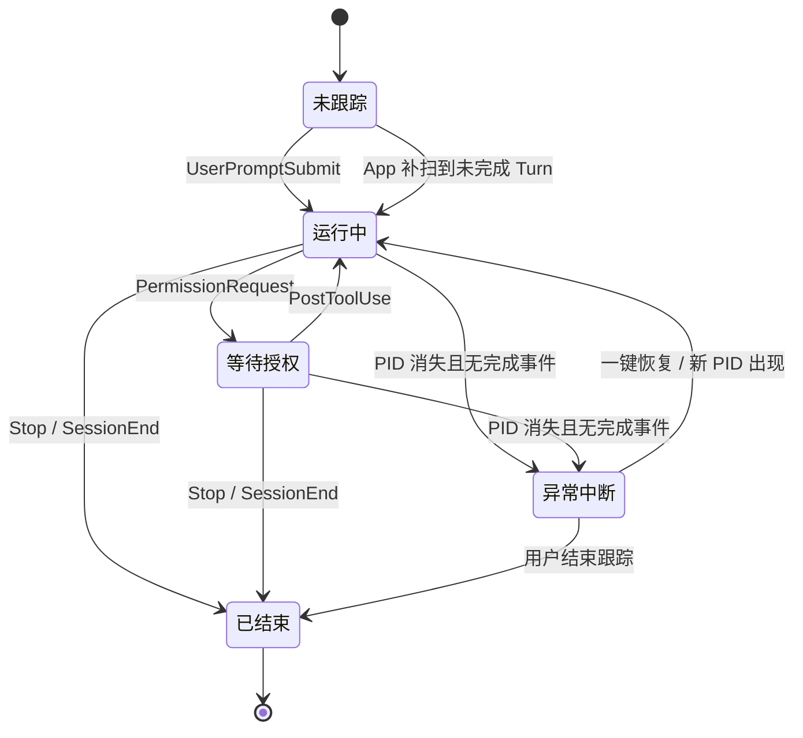
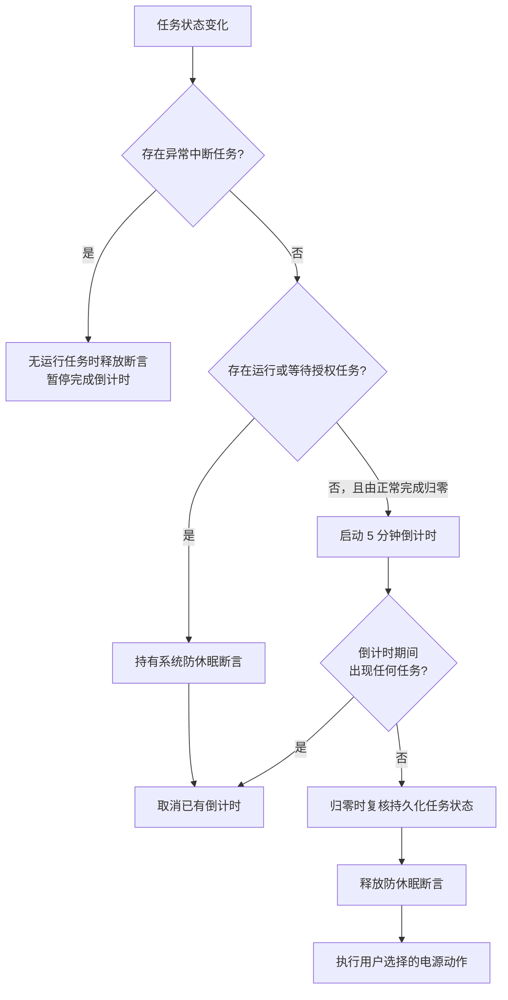

# TermiNap 产品状态与电源决策逻辑

本文是 TermiNap 任务监控与电源自动化的产品逻辑基线，面向产品、设计、开发和测试。它回答三个问题：什么任务算“仍在工作”、什么时候可以执行电源动作，以及屏幕熄灭、系统睡眠、合盖和权限等待分别如何处理。

适用版本：TermiNap 0.2.0。最后更新：2026-08-11。

## 核心产品定义

TermiNap 只把“无需用户介入、仍能自主向前执行”的终端 Codex 任务计为活跃任务；电源动作则采用更保守的“所有已跟踪任务都真正结束”标准。

- 正在推理、调用工具或执行命令的任务属于“运行中”。
- 等待用户批准 Permission 的任务属于“等待授权”，不计入活跃电量，但仍属于未结束任务。
- Codex 进程消失且 session rollout 中没有完成事件的任务属于“异常中断”；它仍需用户处理，但不再持有防休眠断言。
- 收到 `Stop` 或 `SessionEnd` 的任务属于“已结束”。
- Agent 夜班守护开启后，只要至少一个任务仍在运行或等待授权，TermiNap 就阻止用户空闲导致的系统睡眠。
- 夜班守护开启且未结束任务总数从非零变为零时，TermiNap 启动 5 分钟可取消倒计时。
- 倒计时期间重新出现任何任务时，本次电源动作立即取消。
- 夜班守护是一次性开关；倒计时完整结束后先持久化关闭，再执行所选电源动作。

屏幕是否亮着不是任务活跃的判断条件。TermiNap 监控 Codex 生命周期事件，不依赖鼠标移动、窗口可见性、CPU 占用或显示器状态。

## 任务状态如何迁移

读图结论：Permission 和异常中断都不是 Codex Turn 的真正结束。Permission 期间进程仍在，因此继续保持系统唤醒；异常中断已经没有可执行进程，因此释放防休眠断言，但保留会话并暂停完成倒计时。

### Codex Hook 映射

| Codex 信号 | TermiNap 处理器 | 产品状态变化 | 电源决策影响 |
| --- | --- | --- | --- |
| `UserPromptSubmit` | `start` | 未跟踪或等待授权 → 运行中 | 取消已有倒计时并保持系统唤醒 |
| `PermissionRequest` | `permission` | 运行中 → 等待授权 | 不计入活跃电量，但仍保持唤醒且不会启动倒计时 |
| `PostToolUse` | `resume` | 等待授权 → 运行中 | 取消倒计时并恢复防系统睡眠 |
| `Stop` | `stop` | 运行中或等待授权 → 已结束 | 最后一个未结束任务结束时启动倒计时 |
| `SessionEnd` | `end` | 运行中或等待授权 → 已结束 | 清理整个会话状态 |
| PID 消失，rollout 无完成事件 | 进程复检 | 运行中或等待授权 → 异常中断 | 释放该任务的防休眠需求，阻止完成倒计时 |
| 恢复后的同一 session 出现新 PID | 会话补扫或 `start` | 异常中断 → 运行中 | 重新保持系统唤醒 |

只有带 TTY 的本机终端 Codex 会进入该状态机。ChatGPT/Codex 桌面会话和远程 Linux 主机中的 Codex 当前不在监控范围内。

如果终端 Codex 早于 TermiNap 启动，App 会低频枚举带 TTY 的 Codex 进程，并只检查这些进程当前持有的顶层 CLI rollout 文件；同一终端进程打开的子代理 rollout 不会被重复计数。最近的生命周期事件为 `task_started` 且尚无对应完成事件时，任务会被补录；出现 `task_complete` 或 `turn_aborted` 时会被清理。若 PID 消失，TermiNap 会再次检查对应 rollout：存在完成事件则正常清理，否则保留为“异常中断”。Hook 与补扫命中同一 Turn 时，以 Hook 的状态为准，避免覆盖“等待授权”等更精确的实时状态。补扫不读取提示词、模型回复、工具参数或终端输出。

## 电源决策如何执行

| 运行状态 | 防止系统空闲睡眠 | 允许显示器自动熄灭 | 倒计时 |
| --- | --- | --- | --- |
| 至少一个任务运行中 | 是 | 是 | 无 |
| 只有等待授权任务 | 是 | 是 | 无 |
| 只有异常中断任务 | 否 | 是 | 暂停，不启动 |
| 无任务，但处于完成倒计时 | 是 | 是 | 5 分钟 |
| 无任务且无倒计时 | 否 | 是 | 无 |
| 夜班守护关闭 | 否 | 是 | 无 |

倒计时归零后执行用户选择的动作：

- “仅熄屏”调用 `pmset displaysleepnow`。
- “待机”调用 `pmset sleepnow`。
- “关机”通过 System Events 请求 macOS 关机；用户首次选择关机前必须二次确认。
- 三种动作都会消费本次夜班守护；Mac 再次唤醒或开机后不会自动沿用。

## 屏幕熄灭是否影响监控

不会。显示器熄灭与系统睡眠是不同状态。

| macOS 状态 | TermiNap 是否继续运行 | Codex 是否继续运行 | 说明 |
| --- | --- | --- | --- |
| 显示器熄灭 | 是 | 是 | CPU、进程、Timer 和 Hook 均继续工作 |
| 用户空闲触发系统睡眠 | 活跃任务期间会被阻止 | 活跃任务期间继续 | 使用 `PreventUserIdleSystemSleep` |
| 用户手动选择睡眠 | 否 | 否 | TermiNap 不覆盖用户明确操作 |
| 合盖触发睡眠 | 否 | 否 | TermiNap 不覆盖 macOS 合盖策略 |
| 标准合盖外接屏模式仍保持运行 | 是 | 是 | 是否进入该模式由 macOS 和硬件条件决定 |
| TermiNap 退出或崩溃 | 否 | Codex 可能继续 | macOS 自动清理进程级防休眠断言 |

因此，产品承诺是“屏幕可以黑，任务继续跑”，不是“屏幕始终保持点亮”。

## Permission 等待如何处理

收到 `PermissionRequest` 表示 Codex 已无法在无人参与的情况下继续推进。TermiNap 会保留该会话，把它标记为“等待授权”，电量不再计入活跃格数；但由于这个 Turn 尚未结束，系统仍保持唤醒，也不会启动完成倒计时。

当任务等待授权时：

1. 任务从“运行中”变为“等待授权”，但仍保留在未结束任务集合中。
2. TermiNap 继续阻止系统因用户空闲而睡眠，不启动完成倒计时。
3. 用户批准后，`PostToolUse` 将任务恢复为“运行中”。
4. 用户拒绝、取消或停止本轮后，`Stop` 清理该会话。
5. 只有最后一个已跟踪任务收到 `Stop`、`SessionEnd` 或 rollout 完成事件后，才启动 5 分钟倒计时；仅有 PID 消失不足以证明任务完成。

### 当前 Hook 能力边界

Codex 当前没有提供“用户刚刚点击批准”的独立生命周期 Hook。TermiNap 只能在获批工具返回并产生 `PostToolUse` 时确认任务已经恢复。等待期间会继续保持唤醒，因此批准后的工具即使执行超过 5 分钟，也不会被完成倒计时中断。

## 异常中断如何恢复

TermiNap 将“PID 消失且没有 `Stop`、`SessionEnd`、`task_complete` 或 `turn_aborted`”判定为未正常结束。这个状态表示原 Codex 进程已经无法继续执行，但 session 上下文仍可用于恢复。

1. TermiNap 把任务持久化为“异常中断”，取消已有完成倒计时。
2. 如果没有其他运行中或等待授权任务，TermiNap 释放防休眠断言，让 macOS 按正常设置休眠。
3. 浮窗显示原项目和“恢复任务”按钮；点击后在 Terminal 中按原工作目录和 session ID 启动 `codex resume`。
4. 同一 session 出现新 PID 后，任务重新进入“运行中”并恢复防系统睡眠。
5. 用户选择“结束跟踪”后，TermiNap 才把该任务视为已处理；若没有其他未结束任务，则启动 5 分钟倒计时。

恢复会话遵循 [Codex CLI 的 `resume` 命令](https://learn.chatgpt.com/docs/developer-commands?surface=cli)。恢复前的提示会要求 Codex 先检查工作区和已产生的副作用，再继续未完成任务；TermiNap 不会尝试复活已经终止的 shell 子进程。

macOS 只能让 TermiNap 确认 Codex 进程已经消失，无法可靠区分 Terminal 崩溃、用户强制退出或其他外部终止。因此产品文案统一使用“任务未正常结束”，不声称已经识别出具体崩溃原因。

## 多任务规则

TermiNap 按会话跟踪任务，并以“未结束任务总数”决定是否允许执行电源动作。

- 一个任务等待授权、另一个任务仍在运行：继续保持系统唤醒。
- 只有等待授权任务：继续保持系统唤醒，不启动倒计时。
- 只有异常中断任务：释放防休眠断言，但阻止完成倒计时，直到恢复或结束跟踪。
- 多个任务依次结束：只有最后一个未结束任务退出后才开始倒计时。
- 倒计时期间出现新任务：立即取消倒计时。
- 旧 Turn 的延迟 `Stop` 不会清除同一会话中更新的 Turn。
- 有 PID 的存活 Codex 进程不会仅因运行超过 24 小时被清理。
- 无法取得 PID、且仍标记为运行中的兼容状态最多保留 24 小时；已经确认的异常中断会保留到用户恢复或结束跟踪。

## 本机、合盖与远程工作站边界

TermiNap 当前解决的是“本机终端 Codex 执行期间，Mac 不因用户空闲而系统睡眠”。

- 它不保证普通合盖状态继续运行。
- 如果 macOS 已经进入标准合盖外接屏模式并保持系统运行，TermiNap 状态机照常工作。
- 如果合盖导致系统睡眠，本机 Codex、TermiNap 轮询和倒计时都会暂停，直到 Mac 再次唤醒。
- 新加坡远程工作站中的 Codex 由远端 VM 和 tmux 保活；Mac 本机 TermiNap 当前无法读取其任务状态。

如要让 TermiNap 管理远程工作站任务，需要单独设计经过认证的远程状态同步或心跳协议，不能把本机 Hook 路径直接复制到 Linux VM。

## 必须保持的产品不变量

实现、重构和测试都必须保持以下行为：

1. 显示器熄灭不能导致监控停止。
2. 运行中和等待授权的任务必须阻止系统空闲睡眠；没有存活进程的异常中断任务不得单独持有断言。
3. Permission 等待不能触发完成倒计时或电源动作。
4. PID 消失但缺少完成事件时必须进入异常中断，不得启动完成倒计时。
5. 任意新任务或恢复任务出现时，倒计时必须立即取消。
6. 等待授权或异常中断任务恢复后必须重新计入活跃任务。
7. 电源动作只能在未结束任务总数为零、5 分钟倒计时完整结束且归零复核仍为空后执行。
8. 关闭夜班守护、App 退出或状态读取失败时必须释放防休眠断言。
9. 合盖和远程 VM 能力不得宣传为当前本机版本已经保证的行为。

## 后续产品计划

- Permission 触发时通过飞书等即时通讯渠道提醒用户，并附带任务、项目和主机信息。
- 在 Codex 提供批准结果 Hook 后，把恢复时点从 `PostToolUse` 前移到用户批准完成。
- 将本机任务与可信远程工作站任务统一到可审计的状态协议。
- 增加仅接通电源启用、低电量保护、登录时启动和电源动作结果通知。
- 为合盖外接屏、Permission 等待与恢复、真实电源动作增加端到端验收。

Codex Hook 的事件语义以 [Codex Hooks 官方文档](https://learn.chatgpt.com/docs/hooks) 为准。
